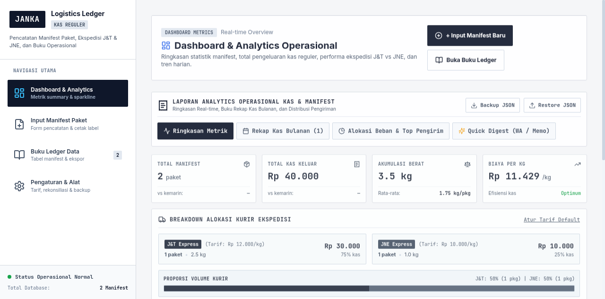
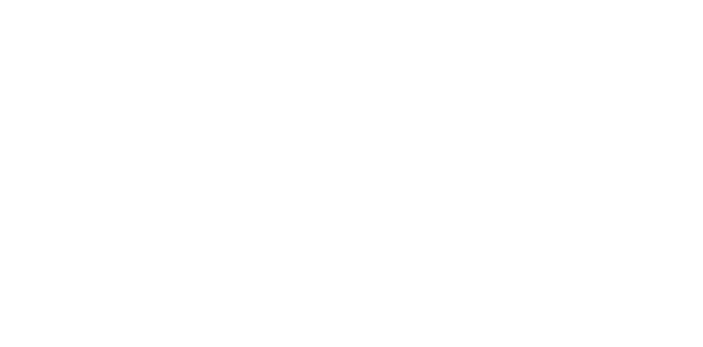
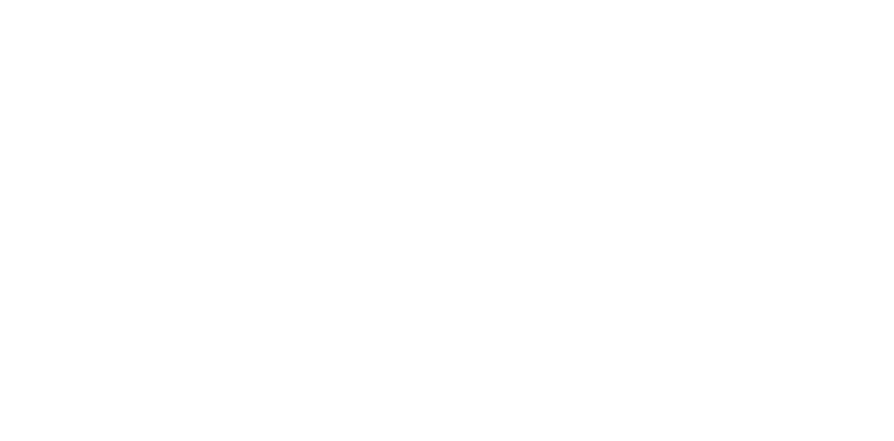
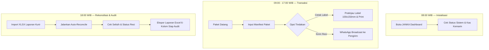

# 📦 JANKA — Logistics Petty Cash & Manifest Ledger System

<div align="center">


[](https://react.dev/)
[](https://vitejs.dev/)
[](https://tailwindcss.com/)
[](https://www.typescriptlang.org/)
[](LICENSE)

*A Enterprise-Grade, Lightweight Logistics Ledger & Thermal Label Printing Workstation*

[Fitur Utama](#-fitur-unggulan) • [Alur Kerja](#-alur-kerja-operasional-harian) • [Tangkapan Layar](#-tangkapan-layar-sistem) • [Spesifikasi Excel](#-spesifikasi-ekspor-excel) • [Panduan Dev](#-panduan-pengembangan-lokal)

</div>

---

## 📌 Deskripsi Sistem

**JANKA** adalah platform manajemen operasional *petty cash* dan pencatatan manifest logistik harian yang dirancang khusus untuk counter, gudang, dan hub pengiriman ekspedisi (J&T Express & JNE Express). JANKA memangkas kerumitan akuntansi gudang dengan sistem terpadu: pencatatan paket kilat, kalkulasi otomatis ongkir/tarif, notifikasi WhatsApp instan, pratinjau & pencetakan label thermal 100x150mm, rekonsiliasi data kurir malam hari, serta ekspor laporan kas bulanan siap audit.

---

## 🖼️ Tangkapan Layar Sistem

### 📊 1. Dashboard & Analytics Operasional
> *Pusat pengawasan metrik kas, sparkline tren volume 14 hari, alokasi pengiriman per kurir, serta rekapitulasi bulanan.*


### 📝 2. Stasiun Input Manifest & Cetak Label
> *Formulir pencatatan ekspres dengan fitur kalkulasi otomatis tarif, notifikasi WhatsApp pengirim, dan modal pratinjau cetak label thermal 100x150mm.*


### 📖 3. Buku Ledger & Pencarian Manifest
> *Tabel arsip manifest berukuran penuh dengan filter rentang tanggal, filter kurir, pencarian resi/pengirim, dan ekspor data Excel.*


---

## ✨ Fitur Unggulan

### 📊 1. Analytics & Executive Reporting
* **Dashboard Metrik Real-Time**: Pemantauan instan Total Manifest, Total Kas Keluar (Rp), Akumulasi Berat (kg), Efisiensi Biaya/kg, dan Rata-rata Berat per Paket.
* **Sparkline Tren 14-Hari**: SVG tren volume harian interaktif dilengkapi node tooltip detail saat di-hover.
* **Breakdown Alokasi Kurir**: Visualisasi proporsi kas dan volume ekspedisi (J&T vs JNE) menggunakan CSS mini bar chart.
* **Quick Executive Digest**: Format memo markdown siap copy untuk laporan harian WhatsApp direksi / manajemen.

### 📝 2. Entry Manifest & Operational Workstation
* **Kalkulasi Tarif Otomatis**: Perhitungan otomatis berdasarkan tarif per kg (bisa di-override manual untuk paket DFOD / khusus).
* **Address Book & Auto-Complete**: Penyimpan riwayat alamat dan pengirim untuk mempercepat pencatatan paket langganan.
* **Thermal Label Generator**: Pratinjau proporsional & cetak label thermal standar 100x150mm lengkap dengan barcode & notifikasi WhatsApp.

### 📑 3. Ledger & Audit Ready Reporting
* **ExcelJS Engine (KAS REGULER)**: Ekspor otomatis laporan kas bulanan dengan worksheet khusus per bulan (`September 2026`, dst.), header freeze, formula `SUM` asli, dan format 6-kolom siap audit.
* **Rekonsiliasi J&T Malam**: Pencocokan otomatis manifest lokal dengan file XLSX laporan kurir untuk mendeteksi resi gantung / belum terproses.
* **JSON Backup & Restore**: Portabilitas data penuh dengan opsi simpan dan pulihkan cadangan JSON lokal tanpa ketergantungan server luar.

---

## 🔄 Alur Kerja Operasional Harian



---

## 📑 Spesifikasi Ekspor Excel

Format berkas ekspor (`.xlsx`) dirancang mengikuti standar pembukuan akuntansi kas reguler:

| Parameter | Spesifikasi |
| :--- | :--- |
| **Worksheet / Sheet** | Dipisah per bulan secara otomatis (`September 2026`, `Agustus 2026`, dll.) |
| **Grup Judul** | **KAS REGULER** + Periode Pembukuan di baris teratas |
| **Struktur 6 Kolom** | `TANGGAL` \| `NO. KIRIM` \| `NAMA PENGIRIM` \| `JENIS PAKET` \| `JUMLAH` \| `JENIS TRANSAKSI` |
| **Formula Akuntansi** | Baris TOTAL menggunakan formula `=SUM(E5:E...)` asli (hidup di MS Excel / LibreOffice) |
| **Tata Letak Cetak** | Landscape, Fit-to-Page Width, Freeze Panes pada Header Tabel |

---

## 🛠️ Panduan Pengembangan Lokal

### Prasyarat
* Node.js v18.0.0 atau lebih baru
* npm v9.0.0 atau lebih baru

### Langkah Installasi & Dev Server

```bash
# 1. Clone repositori
git clone https://github.com/kaarlyz/janka.git
cd janka

# 2. Install dependensi
npm install

# 3. Jalankan development server
npm run dev
# Server lokal berjalan di: http://127.0.0.1:5173

# 4. Jalankan pengujian logika otomatis (Self-Test)
node test_logic.mjs

# 5. Build untuk produksi
npm run build
```

---

## 🏗️ Arsitektur & Teknologi

* **Frontend**: React 18, Vite 5, TypeScript 5, Tailwind CSS 3
* **Iconography**: Lucide React
* **Excel Engine**: ExcelJS (Generasi workbook & worksheet spreadsheet murni browser)
* **Storage & Privacy**: 100% Client-side `localStorage` (`janka_shipments_v1` & `janka_rates_v1`) — *Zero server tracking*.

---

<div align="center">

*JANKA Logistics Ledger System — Built with Precision for Daily Warehouse Operations*

</div>
